<p align="center">
  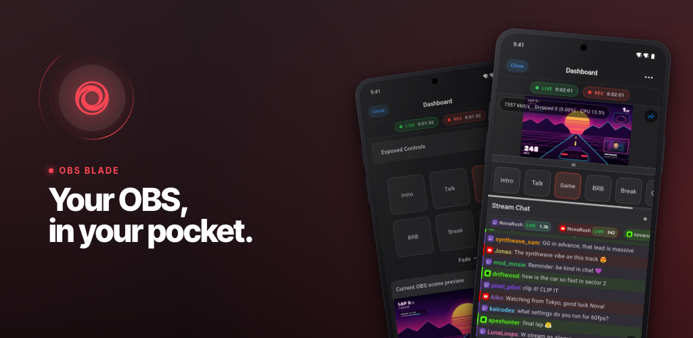
</p>

<h3 align="center">The open source remote for OBS Studio, on iPhone, iPad and Android.</h3>

<p align="center">
  <a href="https://apps.apple.com/app/obs-blade/id1523915884"></a>&nbsp;
  <a href="https://play.google.com/store/apps/details?id=com.kounex.obsBlade"></a>&nbsp;
  <a href="https://f-droid.org/packages/com.kounex.obsBlade/">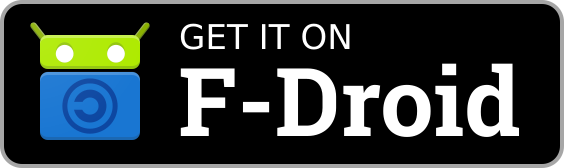</a>
</p>

<p align="center">
  <a href="https://apps.apple.com/app/obs-blade/id1523915884"></a>
  
  
  <a href="LICENSE.md"></a>
  <a href="https://github.com/Kounex/obs_blade/stargazers"></a>
</p>

<p align="center">
  <a href="https://obs-blade.kounex.com"><b>Website</b></a> ·
  <a href="https://www.youtube.com/watch?v=SQWKSXsSIcI"><b>Watch the trailer</b></a> ·
  <a href="#preparation"><b>Setup</b></a> ·
  <a href="#build-it-yourself"><b>Build</b></a> ·
  <a href="https://github.com/Kounex/obs_blade/issues"><b>Issues</b></a>
</p>

<p align="center">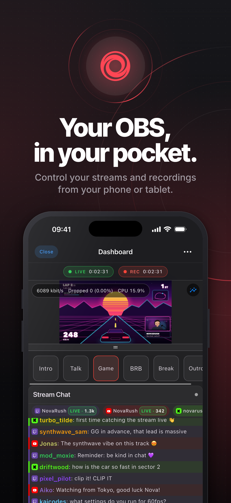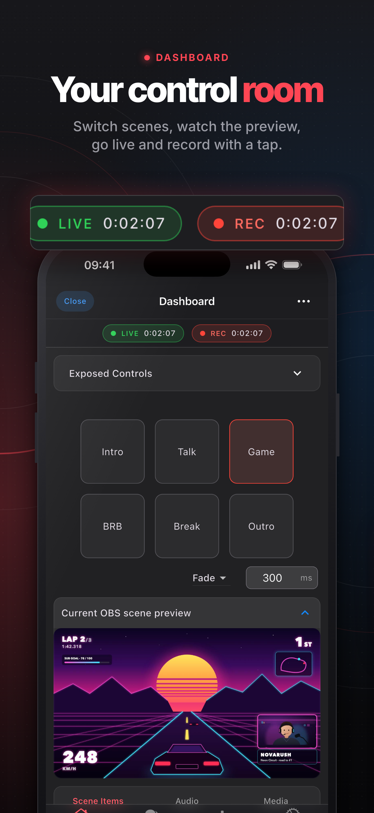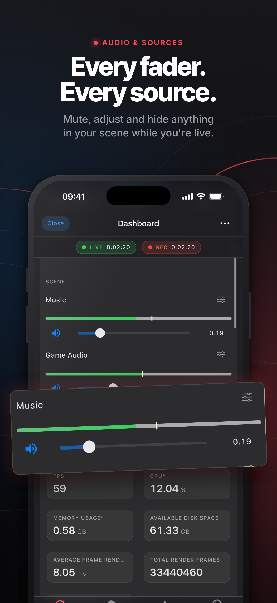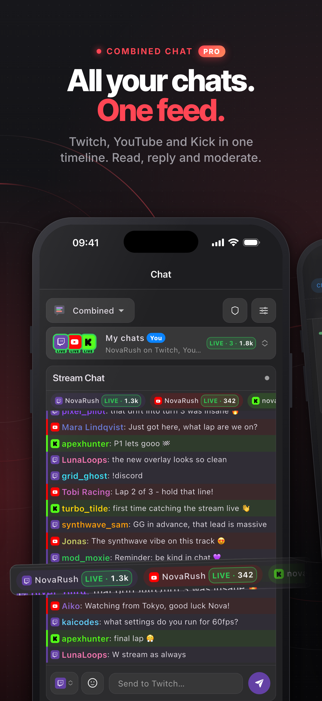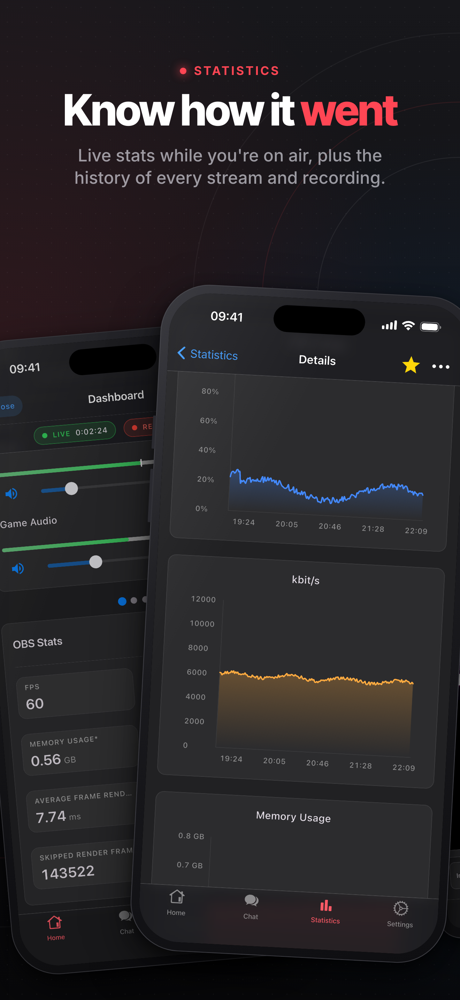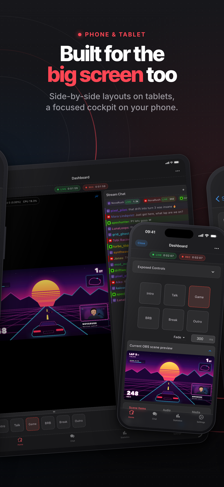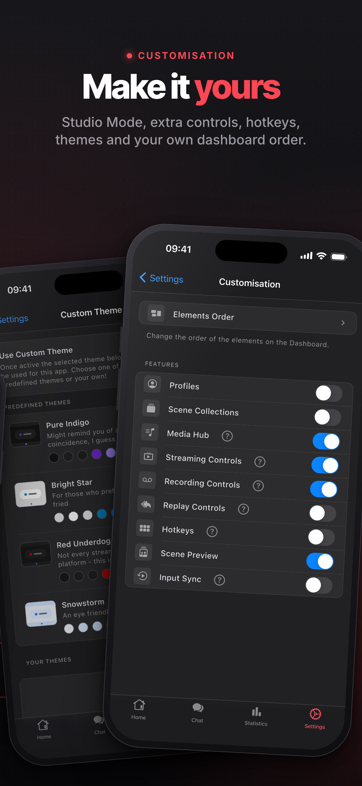</p>

<details>
<summary><b>On iPad</b></summary>
<br>
<p align="center">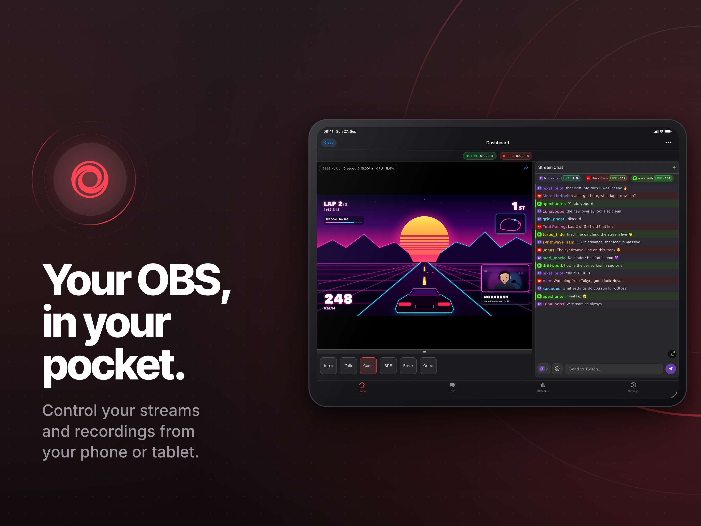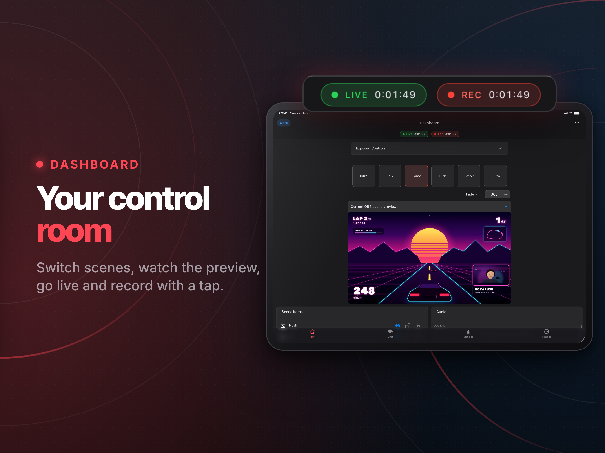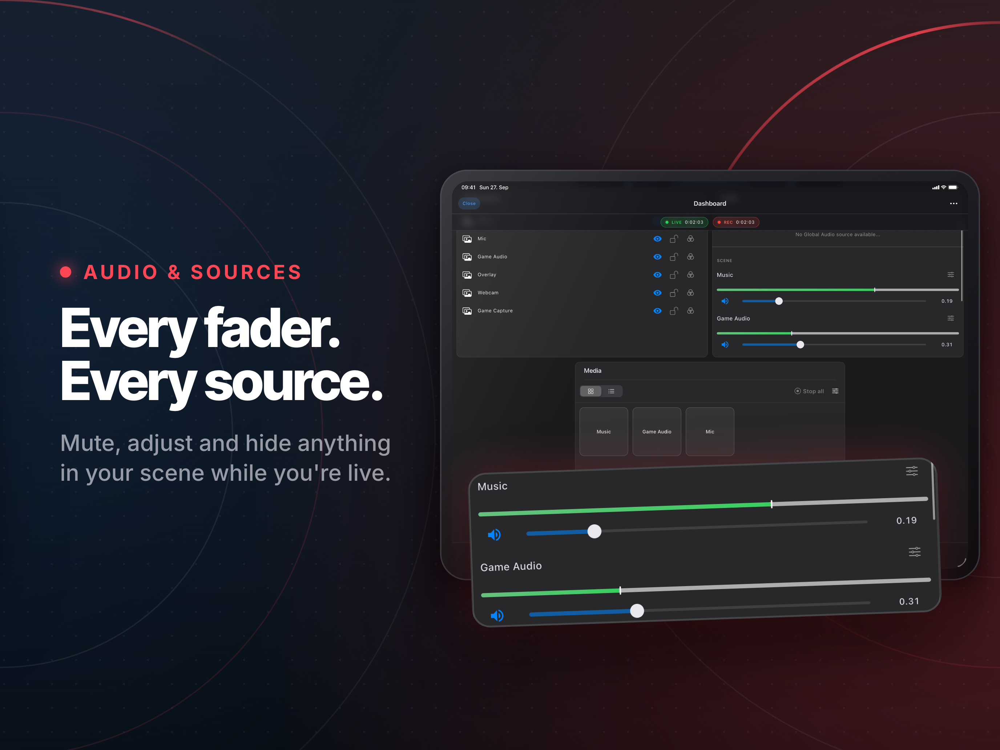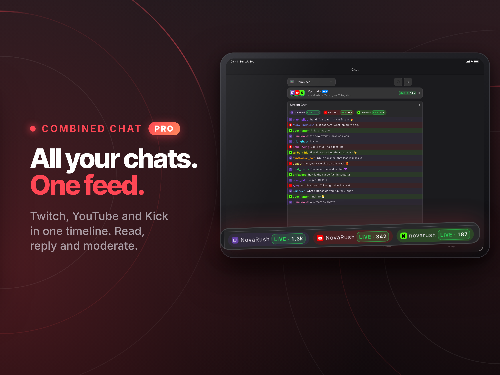<br>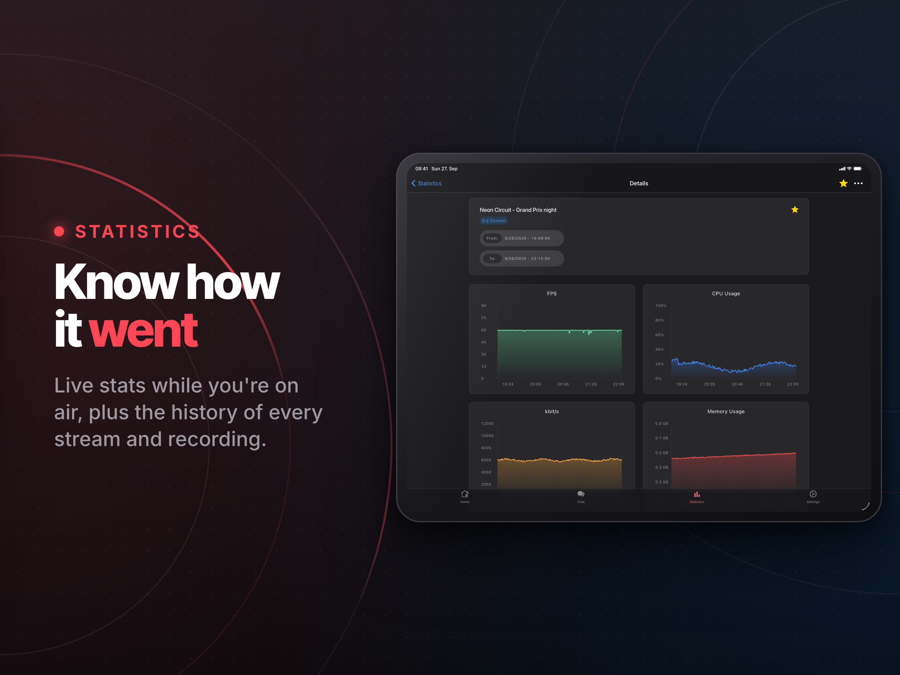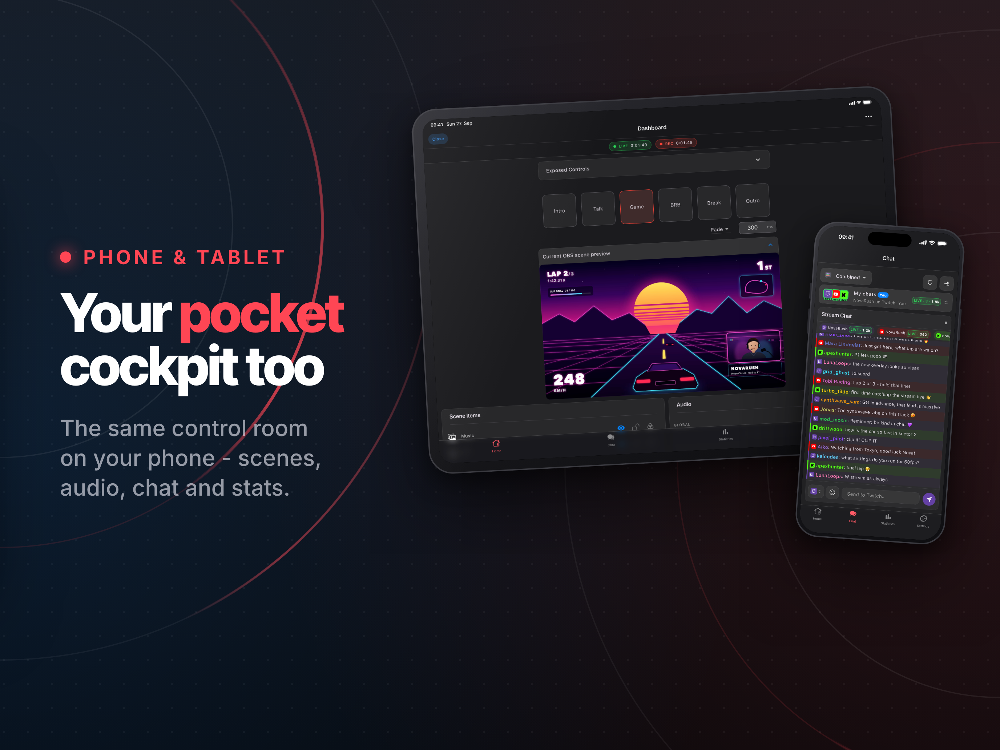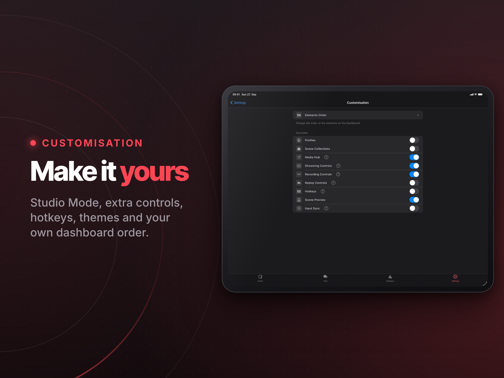</p>
</details>

> [!NOTE]
> OBS Blade is an unofficial app. It is not affiliated with [OBS Studio](https://github.com/obsproject/obs-studio) or the OBS Project.

## Run your whole show from your phone

OBS Blade connects to OBS Studio over your network, so you can switch scenes, mix audio, watch your stream health and keep up with chat without leaving your game or your camera. It's built for phones and tablets alike: a focused cockpit on the phone, side-by-side layouts on the big screen.

<table>
<tr>
<th width="50%">Free, forever</th>
<th width="50%">OBS Blade Pro</th>
</tr>
<tr>
<td valign="top">

- **Go live:** start and stop your stream, recording, replay buffer and virtual camera
- **Scenes:** switch scenes, with Studio Mode and transitions, and show or hide any source
- **Audio:** mix with live volume meters, or mute in one tap
- **Preview:** watch a live preview of the current scene
- **Canvases** (OBS 32.1+): browse vertical and extra canvases, and run Aitum Vertical's own stream, recording and replay buffer
- **Control:** switch profiles and scene collections, trigger hotkeys
- **Stream health:** FPS, CPU, bitrate and dropped frames, live
- **Statistics:** look back on every past stream and recording
- **Chat:** Twitch, YouTube, Kick and Owncast in their own tab, or next to your controls while you're live
- **Your layout:** arrange the dashboard your way

</td>
<td valign="top">

- **Every chat, one place:** native Twitch, Kick and YouTube chat, on their own or merged into one live timeline where replies land on the right platform
- **Chat that keeps up:** 7TV, BTTV and FFZ emotes, an emote picker, autocomplete, role badges, highlights, mute words and search
- **Never miss a supporter:** an activity feed for your own channels, with follows, subs, raids, cheers, Super Chats and KICKs in one list and a to-thank queue for shout-outs
- **Hear your chat:** messages read out loud while you play, in each message's own language if you like
- **Moderate from your pocket:** delete, timeout and ban on every platform, plus AutoMod, unban requests and chat modes on Twitch
- **Your own themes:** design custom color themes for the whole app

Monthly, yearly or a one-time lifetime unlock.

</td>
</tr>
</table>

## Get the app

| Where | What you get |
|---|---|
| [App Store](https://apps.apple.com/app/obs-blade/id1523915884) | The current release for iPhone and iPad  |
| [Google Play](https://play.google.com/store/apps/details?id=com.kounex.obsBlade) | The current release for Android phones and tablets |
| [F-Droid](https://f-droid.org/packages/com.kounex.obsBlade/) · [GitHub Releases](https://github.com/Kounex/obs_blade/releases/latest) | An older open source build (3.2.0) from the [`foss`](https://github.com/Kounex/obs_blade/tree/foss) branch, without the features added since |

## Preparation

OBS Blade talks to OBS Studio through the **OBS WebSocket** server.

1. **OBS Studio 28 or newer** ships with OBS WebSocket built in. Older versions need the [obs-websocket](https://github.com/obsproject/obs-websocket/releases) plugin, **version 5.x or newer** (upgrading OBS Studio is the better route).
2. In OBS, open **Tools → WebSocket Server Settings**, tick **Enable WebSocket server**, and note the port (default `4455`) and the password if authentication is on.
3. Put your phone or tablet on the **same network** as the computer running OBS.
4. Open OBS Blade. Autodiscovery finds running OBS instances on its own. You can also type in the computer's [local IP address](https://www.whatismybrowser.com/detect/what-is-my-local-ip-address) or a domain name.

> [!TIP]
> Can't connect? Check that the port isn't blocked by the computer's firewall, and that both devices really are on the same network (guest Wi-Fi often isolates devices).

## Build it yourself

OBS Blade is a [Flutter](https://flutter.dev) app. Install Flutter by following the [official guide](https://docs.flutter.dev/get-started/install) and make sure your target platform shows up as ready:

```bash
flutter doctor -v
```

Then fetch the dependencies and run it:

```bash
flutter pub get
flutter run
```

Generated code (MobX stores, Hive adapters, freezed models) is checked in. If you change any of those sources, regenerate it:

```bash
dart run build_runner build --delete-conflicting-outputs
```

**Branches:** `master` is the current app. `foss` builds the F-Droid version, and `legacy` keeps the old app for OBS WebSocket 4.x.

**Contributing:** issues and pull requests are welcome. [`AGENTS.md`](AGENTS.md) and [`docs/`](docs/) explain the architecture, starting with [`docs/obs-websocket-architecture.md`](docs/obs-websocket-architecture.md).

## Feedback

Found a bug or have an idea? [Open an issue](https://github.com/Kounex/obs_blade/issues) or write to **contact@kounex.com**.

## Support

The core of OBS Blade stays free, with no ads. If it helps your streams, getting **Pro** or leaving a tip in the app is the best way to keep it going. You can also support it here:

<p>
  <a href="https://www.buymeacoffee.com/Kounex"></a>&nbsp;
  <a href="https://paypal.me/Kounex"></a>
</p>

## License

OBS Blade is licensed under the [GNU GPL v3](LICENSE.md).
